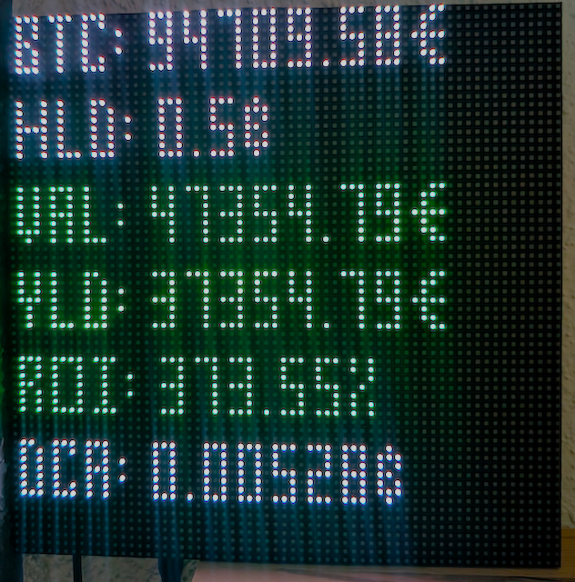

# Different Variants of BTC Tracking
## 1. LCD-Tracker

I wrote this tracker to use an i2c 16x2 display that I had around, to put it to use. It is connected to my Raspberry Pi Zero W in a 3D printed Case. 

The connection pinout for Raspberry Pi:

The program starts with a cli setup where you enter:

1. Which currency you want to use (EUR / USD)
2. How many BTC you own
3. Your cost for those BTC (you can see this in you portfolio tracker)
4. What you DCA amount is (optional)

This will give you following output on your 16x2 Display:
1. Page 1 -> Current BTC Price / Coin amount you own
2. Page 2 -> Current Profit or Loss / Return of Investment in %
3. Page 3 -> BTC you get for your DCA / DCA sum per year
4. Page 4 -> Pi CPU Temperature readout / [future ideas]

Software used:
1. To track the BTC price I used [Bitcoin Value for Python](https://github.com/dewittethomas/bitcoin-value)
2. To interface with the HD44780 16x2 [RPLCD](https://github.com/dbrgn/RPLCD?tab=readme-ov-file)

## 2. Rich-CLI-Tracker

This follows the same idea but will stay in the CLI and display a summary in your command line. 

## 3. 64x64 Matrix LED Tracker

This follows the same idea but cycles through data on matrix led

Software used:

1. To track the BTC price I used [Bitcoin Price from Blockchain.info](https://blockchain.info/ticker)
2. To style the CLI output I used [Rich](https://github.com/Textualize/rich)
